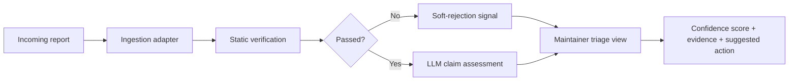

# SlopGuard

> Triage layer for vulnerability disclosures, built for open-source maintainers being overwhelmed by AI-generated security reports.

**Status: design phase — early development.** This repository describes the architecture and design choices. Code is being written; first prototype expected in June 2026.

---

## The problem

Since late 2024, maintainers of widely-depended-on projects have been publicly documenting an unsustainable flood of LLM-hallucinated vulnerability reports.

- **cURL** ended its HackerOne bug bounty program in January 2026. Daniel Stenberg reported that the confirmed-vulnerability rate had dropped from above 15% to below 5%.
- **Linux kernel.** Linus Torvalds, in the 6.x release notes (May 2026), called the security mailing list "almost entirely unmanageable."
- **Jazzband** (Python collective) shut down entirely, citing AI-generated spam as the primary driver.
- **CPython, urllib3, Godot** maintainers regularly document hours spent refuting reports that hallucinate code that does not exist.

GitHub announced in March 2026 it will build AI-assisted triage into its proprietary Private Vulnerability Reporting flow ([Discussion #189802](https://github.com/orgs/community/discussions/189802)). Three reasons why this is not sufficient:

1. It is not yet shipped.
2. It will be GitHub-only.
3. It will be closed source.

Projects on GitLab, Codeberg, Forgejo, SourceHut, or email-based disclosure have nothing. Projects publicly leaving GitHub (Ghostty in April 2026, Zig in December 2025) lose access to whatever GitHub builds.

The OpenSSF Vulnerability Disclosures Working Group is currently soliciting community contributions on this exact problem. SlopGuard is a candidate contribution.

## What SlopGuard does

For each incoming vulnerability report, SlopGuard runs a deterministic static verification layer first, then a grounded LLM claim assessment. It outputs:

- A confidence score (0–100) that the report describes a genuine vulnerability.
- An evidence panel: which checks passed, which failed, and why.
- A suggested action: fast-track / standard review / request clarification / likely slop.
- A draft response the maintainer can edit and send to the reporter.

**The maintainer always makes the final call.** SlopGuard never closes a report on its own.

## Architecture

The architecture is documented in [`docs/architecture.md`](docs/architecture.md).

### Components

**Ingestion adapter.** Subscribes to vulnerability events from supported platforms:
- GitHub App listening to `repository_advisory` events (`security_events: read`, `security_advisories: write`)
- GitLab webhook on confidential issues
- Maildir watcher for email-based disclosures (the `security@project` pattern)
- CLI for ad-hoc triage of a JSON-formatted report

All sources normalize to a common internal schema.

**Static verification layer.** Runs first, deterministic, before any LLM call.
- **Code reference grounding.** Every file path, function name, line number, and symbol mentioned in the report is checked against the actual repository at the claimed commit. A report citing `lib/curl_sasl.c:471` is flagged if line 471 does not exist or if the file does not exist.
- **Advisory deduplication.** Fuzzy-matches the report against the GitHub Advisory Database (GHSA) and NVD via TF-IDF + n-gram overlap.
- **CWE plausibility.** Flags reports claiming CWE classes incompatible with the project's surface (e.g., SQL injection against a project that never touches a database).
- **Reporter signal.** Computes GitHub account age, prior credited advisories, and submission velocity. New accounts are not penalized, only routed differently.

**LLM-assisted claim assessment.** Only reports passing the static layer reach this stage. The LLM is used as a grounded reasoner over evidence the static layer has already extracted, not as an autonomous oracle. Prompts are constrained, outputs are typed (Pydantic JSON schema). Hallucination resistance comes from grounding: the model is forbidden from referencing files or symbols not in the provided context.

Methodological foundation: [HalluJudge (Tantithamthavorn et al., ICSE 2026)](https://arxiv.org/abs/2601.19072) demonstrated F1 = 0.85 at ~$0.009 per assessment when the LLM operates over structured context.

**Decision layer.** Posts an internal-only triage summary visible only to the maintainer.

## What SlopGuard is not

To avoid duplicating existing efforts, here is what SlopGuard explicitly does **not** try to be:

- **Not a PR slop detector.** [CodeRabbit](https://docs.coderabbit.ai/pr-reviews/slop-detection) and the [Anti-Slop GitHub Action](https://github.com/peakoss/anti-slop) cover that. SlopGuard targets vulnerability reports.
- **Not a paid SaaS.** [HackerOne Hai Triage](https://www.hackerone.com/platform/triage) is a fine product for HackerOne customers. SlopGuard is for the maintainers who are not on HackerOne.
- **Not a vulnerability finder.** [GitHub Security Lab Taskflow Agent](https://github.blog/security/community-powered-security-with-ai-an-open-source-framework-for-security-research/) helps researchers find new bugs. SlopGuard helps maintainers filter incoming reports. Inverse problem.
- **Not autonomous.** SlopGuard suggests; maintainers decide.

## Roadmap

| Month | Milestone |
|---|---|
| 1 | Schema definition, GitHub App skeleton, static verification layer. CLI prototype against ~30 hand-curated slop reports drawn from public refusals. |
| 2 | LLM-assisted claim assessment via API. Structured output schemas, fallback handling, per-report cost accounting (target: <$0.05/report). |
| 3-4 | GitLab adapter, email/Maildir adapter, self-hosted deployment guide, prompt-injection hardening, security review. SlopGuard 1.0 release. |
| 5-6 | Pilot deployments with willing maintainers. False-positive refinement. Public benchmark dataset published. Write-up coordinated with the OpenSSF Vulnerability Disclosures Working Group. |

## Funding

SlopGuard is being developed under grants pending review. The project is licensed MIT from day one; all artifacts (code, benchmark dataset, documentation) will be released openly regardless of funding outcome.

## Contributing

The project is in its design phase. Once the first prototype is published (estimated June 2026), contributions will be welcomed. For now, the most useful contribution is feedback from maintainers actually suffering from this problem.

If you maintain an open-source project and have been receiving AI slop vulnerability reports, please open an issue describing your experience. Anonymous reports are fine. Sample slop reports (with personal information redacted) are particularly valuable for building the benchmark dataset.

## Security

See [SECURITY.md](SECURITY.md). A vulnerability triage tool needs to take its own security posture seriously.

## License

MIT. See [LICENSE](LICENSE).

## Acknowledgments

This project draws methodological inspiration from:

- Seth Larson's December 2024 essay ["A new era of slop security reports for open source"](https://sethmlarson.dev/slop-security-reports), which named the problem.
- Daniel Stenberg's January 2026 announcement of the [cURL bounty program shutdown](https://daniel.haxx.se/blog/), which made the economic case visible.
- The OpenSSF Vulnerability Disclosures Working Group, whose ongoing community call is the upstream home for this kind of contribution.
- HalluJudge and SAST-Genius for the grounded-LLM-as-reasoner methodology.

None of these projects are affiliated with SlopGuard.

---

*SlopGuard is built and maintained by a solo independent developer. Contact via repository issues for technical questions, or via the email on the OpenSSF working group for coordination.*
